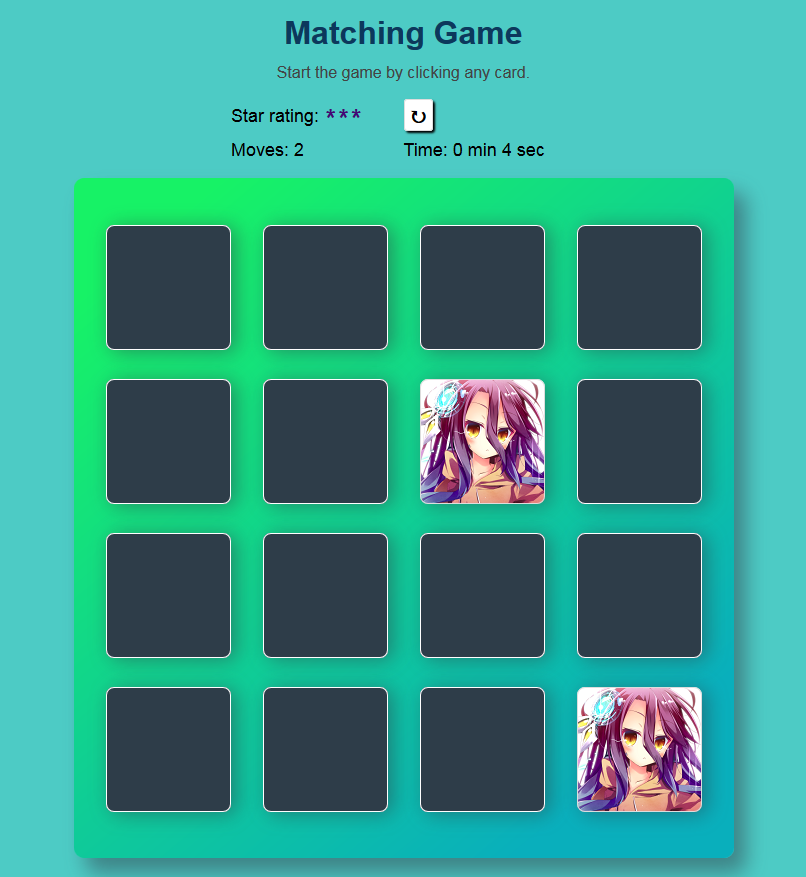

# Memory Game Project

## Table of Contents

* [Instructions](#instructions)
* [Live version of the game](#liveversion)

## Instructions

Test your memory and match the same cards together.  
Challenge yourself to get 3 stars and a good time!

## LiveVersion

Link : https://basqe.github.io/fend-project-memory-game/  

Screenshot : 

### Fend Nanodegree - Web Programming with Javascript Module

Create a Memory Card Game with 16 cards, a score panel showing player's rating, moves, time. At the end of the game a message will pop up to recap player's performance.
The player can restart the game anytime or play it again at the end.
